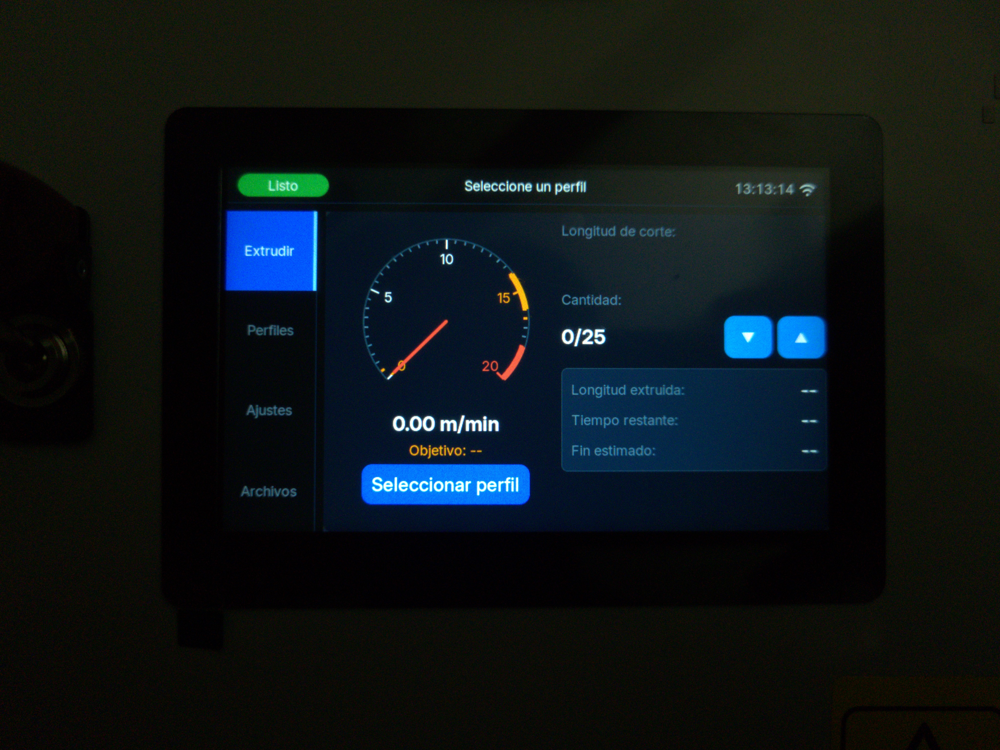
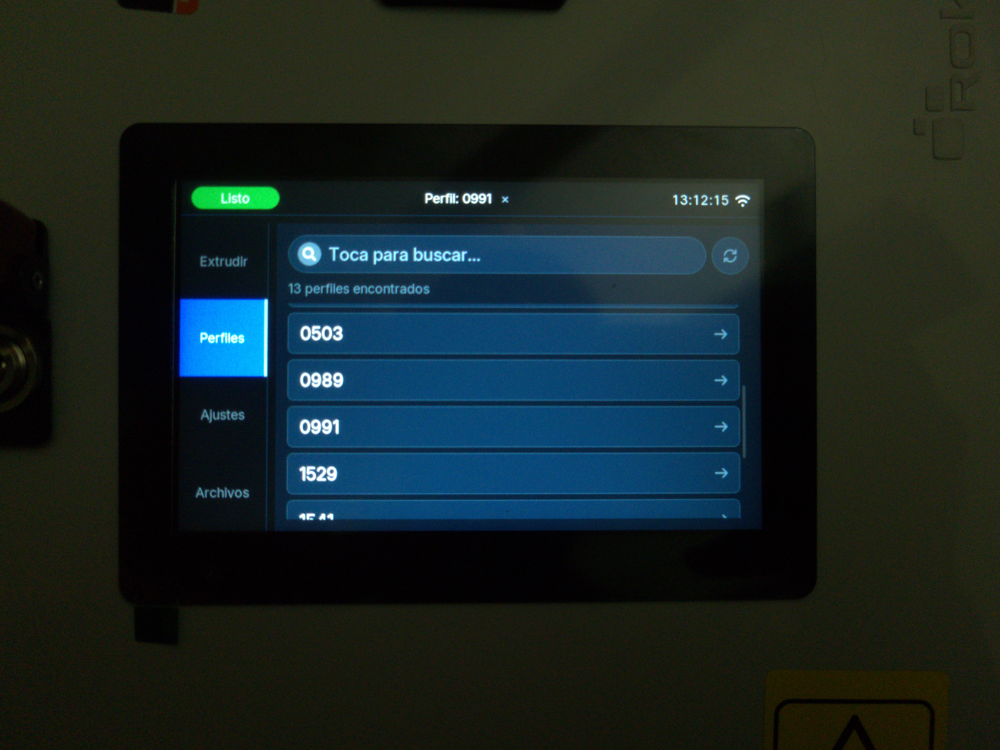
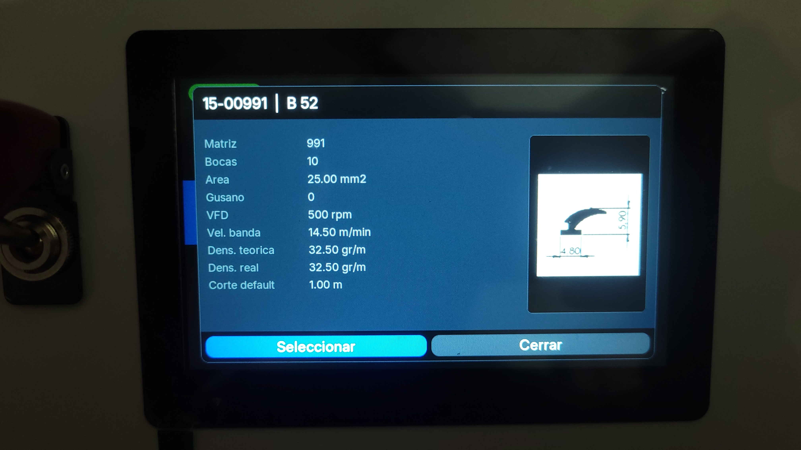
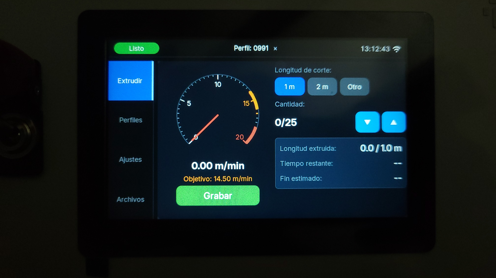
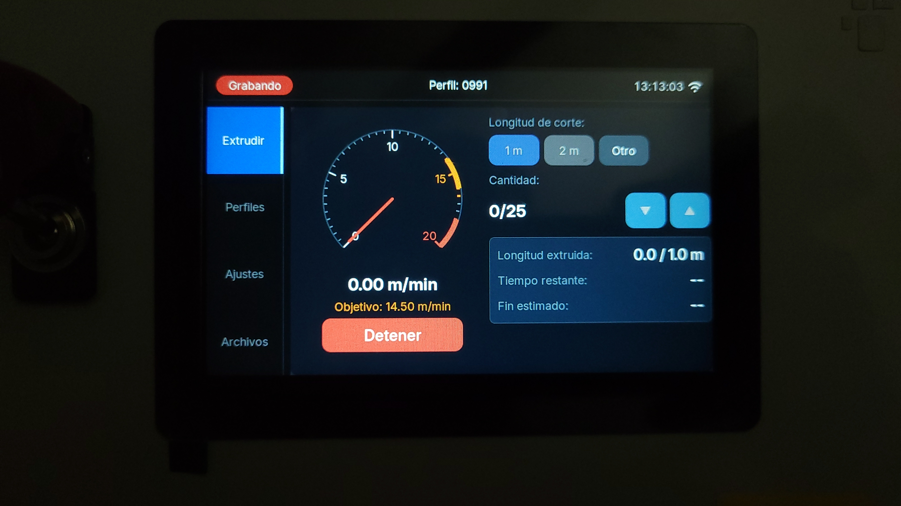
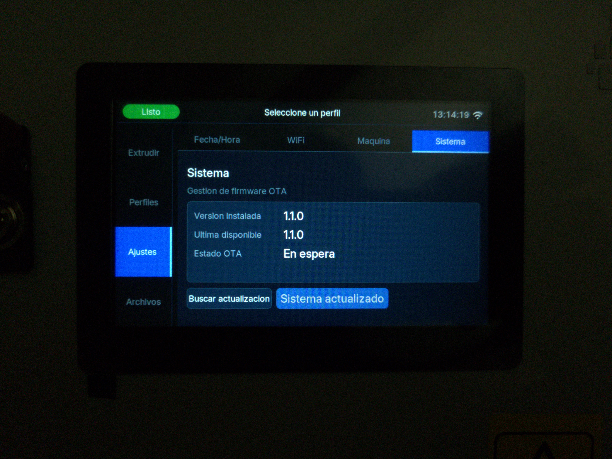
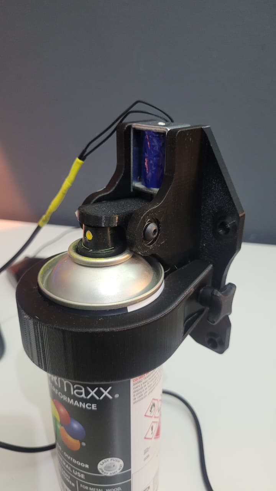
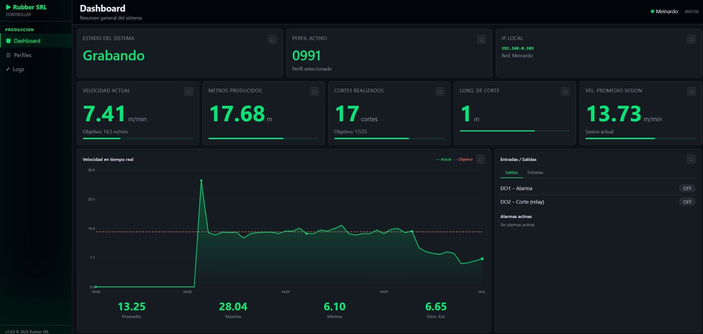
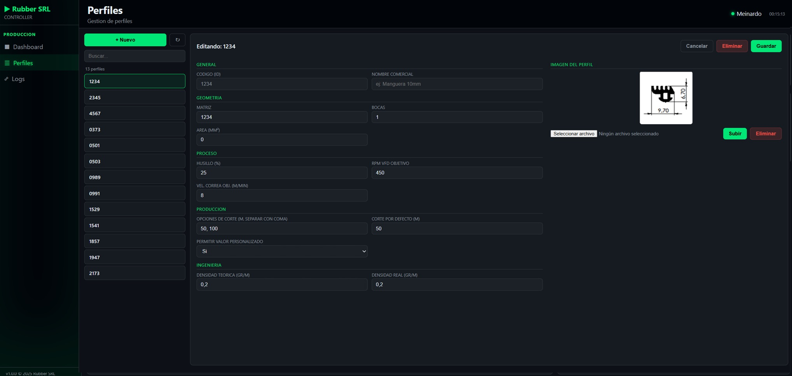

# Extrusion Controller

Embedded industrial control system based on ESP32-S3 for real-time extrusion process automation, monitoring and production logging.  
In this particular application, the system was developed for rubber profile extrusion lines.

The controller is designed to operate directly in industrial environments with an integrated touchscreen interface, local storage, WiFi connectivity and OTA firmware updates.


### Main screen


### Profile selection


### Profile


### Ready


### Recording


### System


### Painting machine


### Dashboard (WebUI)
|

### Profile create (WebUI)


---

# Main Features

- Industrial touchscreen HMI interface
- Real-time extrusion speed measurement
- Produced length calculation
- Automatic relay actuation for profile marking or cutting
- Production profile management
- Production history logging to SD card
- Integrated HTTP API
- Remote WiFi dashboard for real-time production statistics
- HTTPS OTA firmware updates
- Automatic firmware rollback
- Scalable modular architecture
- ESP-IDF based firmware

---

# Industrial Application

The system was designed to automate the extrusion process of rubber profiles.

The controller:

- Detects material linear movement using an inductive sensor mounted on a toothed wheel
- Calculates linear speed and production metrics
- Automatically actuates a relay for paint marking or automatic cutting systems
- Provides alarm and warning management
- Stores production history logs
- Allows complete configuration per extrusion profile

---

# Controller Hardware

- ESP32-S3
- 800x480 RGB touchscreen display
- LVGL graphics framework
- Integrated WiFi
- SD Card
- RTC
- Relay outputs
- 24V opto-isolated inputs and outputs
- Conducted EMI noise filtering at control cabinet power input

---

# Production Features

- Instantaneous speed
- Average speed
- Produced meters
- Produced kilograms
- Cut quantity
- Daily, weekly, monthly and yearly production history
- Editable extrusion profiles
- Process parameters
- Runtime and downtime statistics

---

# Graphical User Interface

The UI was developed using:

- LVGL
- Modern industrial HMI design
- Modular architecture
- Reusable components
- Touchscreen navigation

---

# Build

## Requirements

- ESP-IDF v5.5.x
- Python
- Ninja
- Xtensa Toolchain

---

## Compile

```bash
idf.py build
```

---

## Flash

```bash
idf.py flash monitor
```

---

# OTA Firmware

Firmware distribution is handled through:

https://github.com/Meina88/integral-controller/releases

---


# Disclaimer

This project was originally developed for private industrial applications related to rubber profile extrusion systems.

The author does not guarantee the suitability of this software or hardware for critical, safety-related or commercial production environments.

The use of this firmware, hardware, documentation or overall system architecture is entirely at the end user's own risk and responsibility.

This repository may contain experimental code, work-in-progress features and incompatible changes between versions.


# Development

Project developed by:

## Pablo Meinardo

Mechanical Engineer | Embedded Systems | Industrial Automation

- Mechanical Engineer — UNRC
- Instructional Design — UTN
- Industry 4.0 — UNSAM

## Contact

**Pablo Meinardo**  

📱 [WhatsApp](https://wa.me/+5493586547097)

📧 Email: meinardop@gmail.com

---
