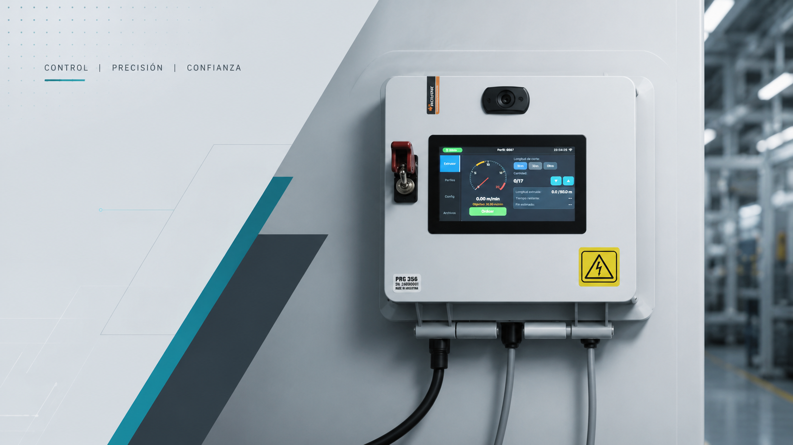
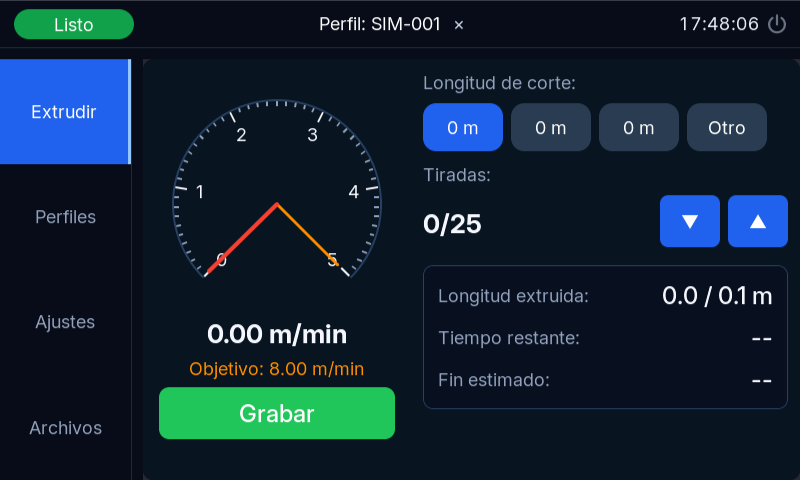
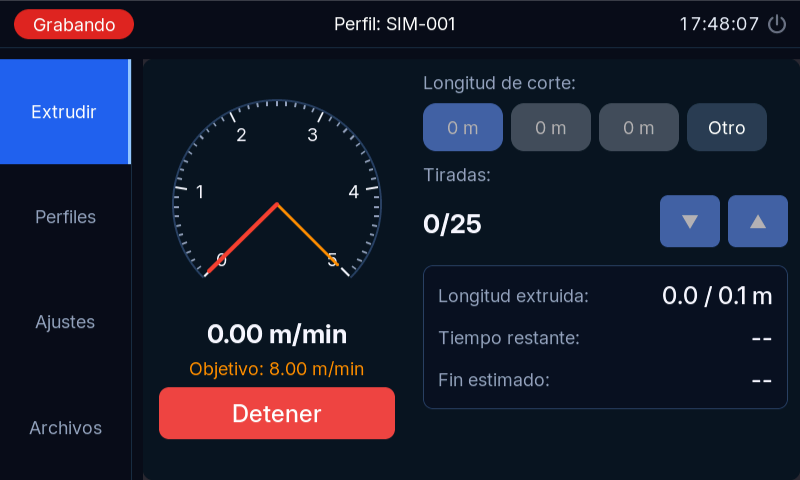
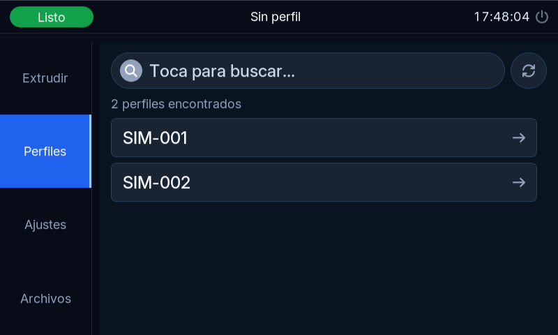
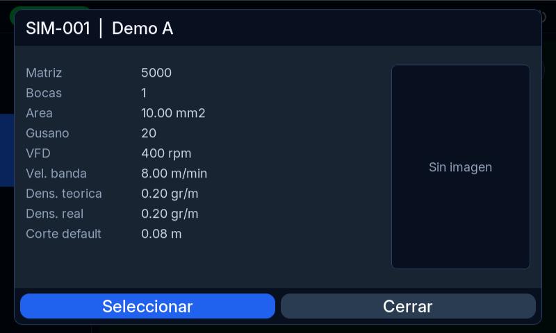
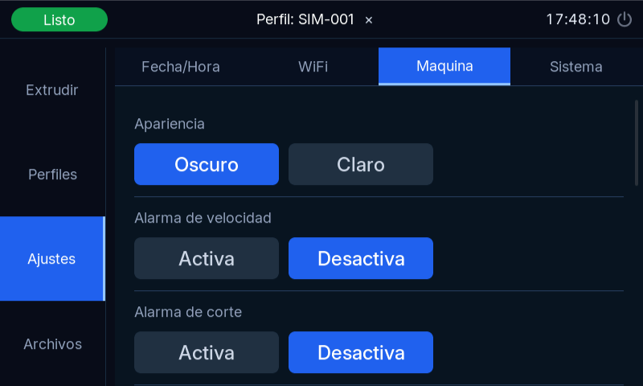
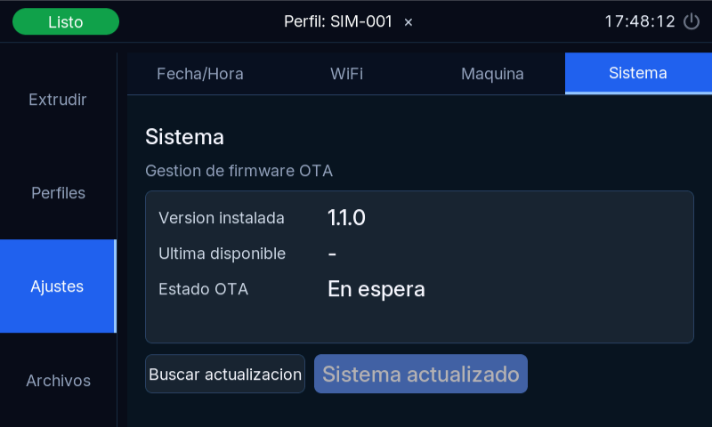

# Industrial Extrusion Monitoring System

Embedded control system based on ESP32-S3 for real-time extrusion process automation, production monitoring and industrial data logging. Developed for rubber profile extrusion lines.

<p align="center">
  
</p>

<p align="center">
  
  
  
  
  
</p>

---

## Features

- Real-time extrusion speed and produced length measurement
- Inductive sensor input with pulse-based calculation
- Production profile management (per-product parameters)
- Automatic relay actuation for marking or cutting
- SD card production logging with historical statistics
- WiFi connectivity with web dashboard and HTTP API
- OTA firmware update with automatic rollback
- Touchscreen HMI — 800×480 RGB display

---

## Interface

<table>
  <tr>
    <td align="center">
      <br>
      <sub>Listo para grabar — perfil cargado</sub>
    </td>
    <td align="center">
      <br>
      <sub>Producción en curso</sub>
    </td>
  </tr>
  <tr>
    <td align="center">
      <br>
      <sub>Lista de perfiles</sub>
    </td>
    <td align="center">
      <br>
      <sub>Detalle de perfil</sub>
    </td>
  </tr>
  <tr>
    <td align="center">
      <br>
      <sub>Ajustes — Máquina</sub>
    </td>
    <td align="center">
      <br>
      <sub>Ajustes — Sistema / OTA</sub>
    </td>
  </tr>
</table>

---

## Hardware

- ESP32-S3
- 800×480 RGB touchscreen (touch GT911)
- IO expander CH422G (I2C)
- SD card storage
- RTC
- Relay outputs
- 24V opto-isolated industrial I/O
- EMI filtered power input

---

## Architecture

```
UI screens
    ↓
Logic layer       ← no direct ESP-IDF calls
    ↓
Driver abstractions
    ↓
Hardware (GPIO, I2C, RTC, relays)
```

Main firmware modules: BSP · UI (LVGL) · Drivers · Production logic · Storage (NVS) · WiFi · HTTP server · OTA

---

## Build

Requires ESP-IDF v5.5.x.

```bash
idf.py build
idf.py flash monitor
```

---

## OTA Releases

https://github.com/Meina88/integral-controller/releases

---

## Disclaimer

Originally developed for private industrial applications. The author does not guarantee suitability for safety-critical or commercial production environments. Use at your own risk.

---

## Development

**Pablo Meinardo** — Mechanical Engineer | Embedded Systems | Industrial Automation

Río Cuarto, Córdoba, Argentina · [meinardop@gmail.com](mailto:meinardop@gmail.com)
